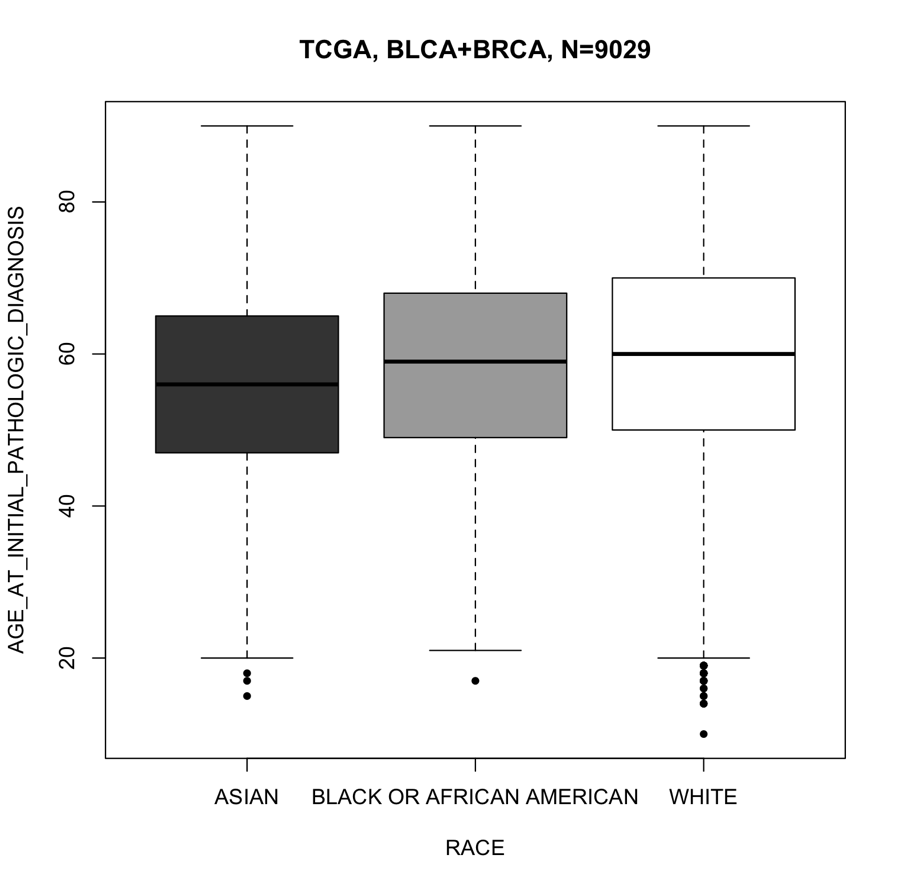

# PatiDem
 * Characterization of PATIent DEMographics

## How to create a package
```
# Create an empty package
R -e "devtools::create('PatiDem')"
vi DESCRIPTION

# Implement the first function
vi R/downloadData.R
R -e "devtools::document()"
vi tests/test_downloadData.R
R -e "testthat::test_dir('tests')"

# Implement the second function
vi R/visualizationBox.R
R -e "devtools::document()"
vi tests/test_visualizationBox.R
R -e "testthat::test_dir('tests')"

# Implement the third function
vi R/statisticalTesting.R
R -e "devtools::document()"
vi tests/test_statisticalTesting.R
R -e "testthat::test_dir('tests')"

# Install the package
R -e "devtools::install()"

# Create a vignette
R -e "library(devtools); usethis::use_vignette('PatiDem')"
vi vignettes/PatiDem.Rmd
R -e "rmarkdown::render('vignettes/PatiDem.Rmd')"

R CMD build PatiDem
```

## How to use the PatiDem Package
### Install the package
```
install.packages("devtools")
library(devtools)
devtools::install_github("lootpiz/PatiDem")
```

### Download TCGA metadata
```
tcga <- downloadData()
```

### Generate a boxplot
```
visualizationBox(tcga, cancer_type = c("BLCA", "BRCA"),
    phenotype = "age_at_initial_pathologic_diagnosis",
    metadata_col = "race",
    metadata_levels = c("WHITE", "ASIAN", "BLACK OR AFRICAN AMERICAN"))
```


### Statistical testing
```
df <- data.frame(column_one = tcga$gender, column_two = tcga$vital_status)
statisticalTesting(df, categorical = T)

df <- data.frame(column_one = tcga$age, column_two = tcga$race)
statisticalTesting(df, categorical = F)
```

### _General purposes_
### Continous variables
```
# two groups
df <- data.frame(column_one = c(1:100), column_two = c(rep("A", 50), rep("B", 50)))
statisticalTesting(df)

# three groups
df <- data.frame(column_one = c(1:100), column_two = c(rep("A", 33), rep("B", 33), rep("C", 34)))
statisticalTesting(df)
```

### Categorical variables
```
# 2 X 2
df <- data.frame(column_one = c(rep("A", 50), rep("B", 50)), 
    column_two = c(rep("A", 10), rep("B", 20), rep("A", 30), rep("B", 40)))
statisticalTesting(df, categorical=TRUE)

# 2 X 3
df <- data.frame(column_one = c(rep("A", 50), rep("B", 50)), 
    column_two = c(rep("A", 10), rep("B", 20), rep("C", 30), rep("B", 40)))
statisticalTesting(df, categorical=TRUE)

# 3 X 3
df <- data.frame(column_one = c(rep("A", 10), rep("B", 50), rep("C", 40)), 
    column_two = c(rep("A", 10), rep("B", 20), rep("C", 30), rep("B", 40)))
statisticalTesting(df, categorical=TRUE)
```

## References & Tutorials
  * Introduction: http://r-pkgs.had.co.nz/intro.html
  * Making packages in R using devtools: https://uoftcoders.github.io/studyGroup/lessons/r/packages/lesson/
  * Writing documentation with Roxygen2: https://kbroman.org/pkg_primer/pages/docs.html
  * knitr in a knutshell: https://kbroman.org/knitr_knutshell/
  * Unit Testing in R: https://towardsdatascience.com/unit-testing-in-r-68ab9cc8d211
  * testthat: https://testthat.r-lib.org/reference/index.html

